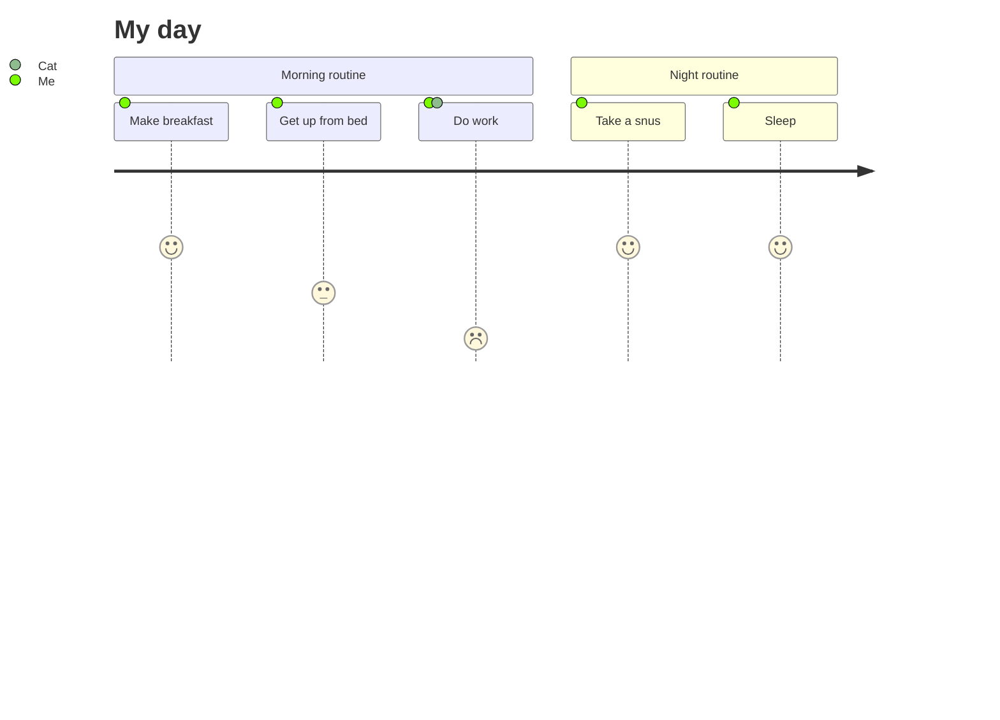
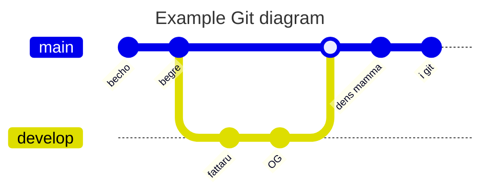

# gittest

### header 3

```mermaid
journey
    title My day
    section Morning routine
      Make breakfast: 5: Me
      Get up from bed: 3: Me
      Do work: 1: Me, Cat
    section Night routine
      Take a snus: 5: Me
      Sleep: 5: Me
      

```

# HEADER 1

``` mermaid 
---
title: Example Git diagram
---
gitGraph
   commit id: "becho"
   commit id: "begre"
   branch develop
   checkout develop
   commit id: "fattaru"
   commit id: "OG"
   checkout main
   merge develop
   commit id: "dens mamma"
   commit id: "i git"

```

